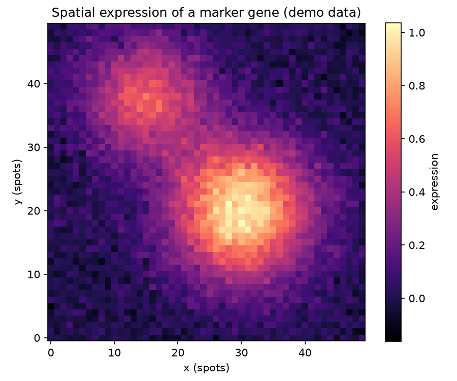

# Spatial Expression Heatmap

Single-cell tells you which cells exist. Spatial transcriptomics tells you where they are — and location is often the whole story in a tumour or a developing organ.

## Why This Matters

Where a gene is expressed within a tissue carries information no dissociated single-cell experiment can: tumour boundaries, immune infiltration zones, developmental gradients. A spatial expression heatmap places each measurement back on the tissue grid, so anatomical structure and its molecular signature line up.

## How It Works

1. Keep each spot's x,y tissue coordinates.
2. Map a gene's expression onto that grid.
3. Render as a heatmap over the tissue.

## What the Demo Shows



The demo shows a marker gene lit up in two tissue regions. The bright zones mark where the gene is active across the section — the kind of spatial pattern you would correlate with anatomy or pathology.

## Run It

```bash
pip install -r requirements.txt
python demo.py
```

> Demonstrated on synthetic data, so it's fully reproducible with no external downloads.
